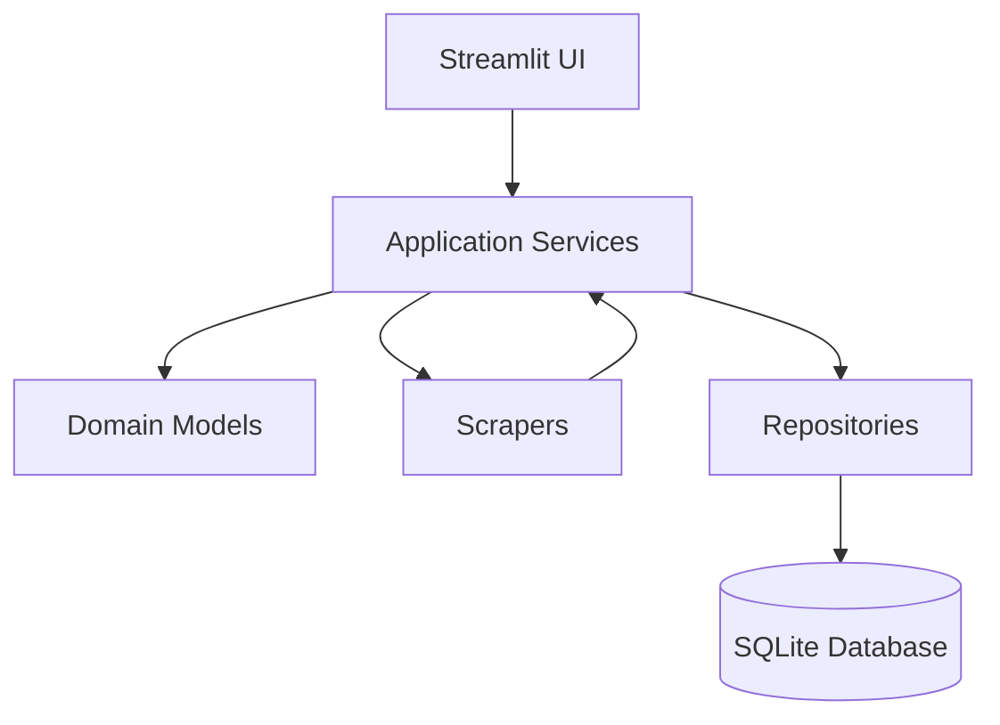
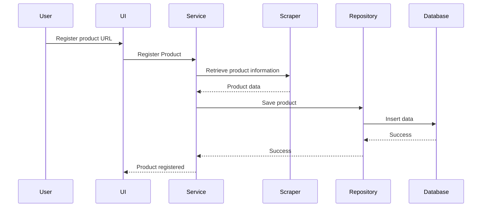

# Software Architecture

**Project:** Price Monitor

**Version:** 0.1.0

**Status:** Draft

**Author:** Luã Kaique da Silva

**Last Updated:** 2026-07-20

---

# 1. Purpose

This document describes the software architecture of Price Monitor.

Its purpose is to define how the application is organized internally, establish clear responsibilities for each module, and provide architectural guidelines for future development.

The architecture prioritizes simplicity, modularity, maintainability, and extensibility. Every component has a well-defined responsibility, minimizing coupling between modules and making future enhancements easier to implement.

This document serves as a reference for contributors and as the foundation for all implementation decisions made throughout the project.

## 2. Architectural Goals

The architecture of Price Monitor has been designed to achieve the following goals:

- Keep the codebase simple and easy to understand.
- Separate business logic from infrastructure and user interface.
- Minimize coupling between application modules.
- Maximize code reuse through modular components.
- Allow new online stores to be added with minimal code changes.
- Facilitate automated testing.
- Support future project evolution without major architectural refactoring.

## 3. Architectural Principles

The project follows the principles below:

### Single Responsibility

Each module should have a single, well-defined responsibility.

### Separation of Concerns

Business logic, infrastructure, and presentation layers must remain independent.

### Low Coupling

Modules should communicate through well-defined interfaces whenever possible.

### High Cohesion

Related functionality should remain grouped within the same module.

### Extensibility

Adding support for a new online store should require creating a new scraper implementation without modifying the existing ones.

### Simplicity

Simple solutions are preferred over unnecessary abstractions.

## 4. High-Level Architecture



# 5. Layer Responsibilities

The application is organized into independent layers, each responsible for a specific part of the system.

## User Interface (UI)

Responsible for interacting with the user through the Streamlit dashboard.

Responsibilities:

- Display monitored products.
- Display historical price charts.
- Receive user input.
- Invoke application services.

The UI layer must not contain business logic or direct database access.

---

## Application Services

Application Services coordinate the system's workflows.

Responsibilities:

- Register products.
- Validate user requests.
- Select the appropriate scraper.
- Coordinate price updates.
- Manage communication between the UI, domain, and infrastructure layers.

This layer contains the application's business logic.

---

## Domain

The Domain layer represents the core business entities.

Examples include:

- Product
- Price Record
- Store

Domain objects should remain independent from external technologies such as databases, web scraping libraries, or Streamlit.

---

## Infrastructure

The Infrastructure layer communicates with external systems.

Responsibilities:

- Web scraping.
- Database access.
- Logging.
- Configuration.

Infrastructure components should never contain business rules.

# 6. Project Structure

The project is organized as follows:

```text
src/

├── app/
│   └── services/

├── domain/
│   ├── models/
│   └── interfaces/

├── infrastructure/
│   ├── database/
│   ├── repositories/
│   ├── scrapers/
│   ├── logging/
│   └── config/

├── ui/

└── main.py
```

This structure separates business logic, infrastructure, and presentation, making the project easier to understand, maintain, and extend.

# 7. Data Flow

The following diagram illustrates the application's primary workflow.



The same architecture is used when updating prices, ensuring a consistent flow throughout the application.

# 8. Extensibility

Price Monitor has been designed to support future expansion with minimal changes to the existing codebase.

New online stores can be supported by implementing additional scraper modules that follow the project's scraper interface.

Likewise, infrastructure components such as the database or user interface can be replaced independently, provided they preserve the expected contracts with the application services.

This modular approach minimizes coupling, facilitates testing, and allows the project to evolve incrementally without requiring significant architectural refactoring.

# 9. Future Improvements

Possible architectural improvements include:

- Repository interfaces for multiple database implementations.
- Dependency Injection.
- Background task scheduler.
- REST API.
- Authentication layer.
- Docker deployment.
- Cloud-native architecture.
- Plugin-based scraper discovery.

# 10. Architectural Decisions

The architecture intentionally prioritizes simplicity over unnecessary abstractions.

The project is designed around the needs of the MVP while preserving a clear path for future evolution.

Every architectural decision should support one or more of the following goals:

- Maintainability
- Extensibility
- Readability
- Testability